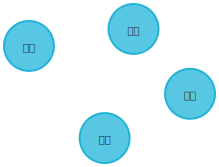
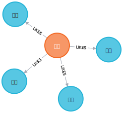

# 实验一 知识图谱初步认知

本实验基于班级同学的兴趣爱好数据, 构建同学爱好的知识图谱. 

本次实验中, 学生需要掌握

- 图数据库 (如 Neo4j 等) 运行环境的安装和配置;
- 图中节点和链接的创建 (包括通过图数据库直接导入数据的方式和通过程序语言连接图数据库创建班级知识图谱)
- 图查询以及图谱的可视化展示.

通过此次实验, 可以使同学掌握整个知识图谱的环境配置, 知识图谱的创建流程以及可视化展示等. 

## 实验内容

### 安装 Neo4j

Neo4j 是一个高性能的图形数据库, 它将结构化数据存储在网络上而不是表中. Neo4j 也可以被看作是一个高性能的图引擎, 该引擎具有成熟数据库的所有特性. 程序员工作在一个面向对象的, 灵活的网络结构下, 而不是严格, 静态的表中, 而可以享受到具备完全的事务特性的企业级的数据库的所有好处. Neo4j 因其嵌入式, 高性能, 轻量级等优势, 越来越受到关注。

在图中涉及到两种基本的数据类型: Node (节点) 和 Relationship (关系). 在 Neo4j 中, Node 和 Relationship 均可以包含键值对 (key/value) 形式的属性. Node 由 Relationship 所定义的关系连结起来, 形成关系型网络结构. [^what-is-graph-db]

安装 Neo4j 需要注意使用对应版本要求的 JDK 版本.

### 图数据库的构建

实验的目标是构建同学兴趣爱好数据库. 根据分析可得, 应对 "同学" 和 "爱好" 这两个实体进行建模, "同学的爱好" 使用 "同学 (Person)" 和 "爱好 (Hobby)" 之间的关系进行表示. [^graph-modeling]

这样的表示方式, 具有共同爱好的同学之间将通过一个 "爱好" 节点进行关联, 且不会产生重复数据, 也便于对数据进行增删改查.

#### 原始数据的分析与整理

同学兴趣爱好表格原始数据类似如下:

| name | id | hobbies |
| :--- | :--- | :--- |
| ... | ... | ... |
| 小明 | 0000001 | 唱歌 听音乐 看电视剧 看小说 追星 |
| 小红 | 0000002 | 音乐，睡觉 |
| ... | ... | ... |


可以发现，这个数据的 hobbies 项存在多个数值, 且没有统一规范输入的格式; 除此之外, 不同的同学对于同一 "兴趣爱好" 的表述也有差异.

将表格另存为 CSV 格式后, 可以载入到 Python 中. 这里使用 `csv.DictReader` 将信息读取为字典的形式.

```python
import csv

with open('hobbies.csv') as f:
    data = [record for record in csv.DictReader(f)]
```

留意到 `hobbies` 字段的文本由多个字段组成, 需要对字段进行分割. 

但是每项记录中各字段间采用的分隔符各不相同, 可以采用 `re.split()` 方法进行处理:

```python
import re

for record in data:
    # 分割字段
    record['hobbies'] = re.split('，|、|\ |；|, |;', record['hobbies'])
    # 去除空项
    record['hobbies'] = [token for token in record['hobbies'] if len(token) > 0]
```

#### 提取兴趣爱好关键词

留意到存在类似 "游戏小说" 这样将两项汉语词汇合并写成一个词的, 需要分割开来, 可以使用 `jieba.lcut()` 方法, 参考:

> 从理论上来讲, 这种方法并不精确, 受限于事件原因, 这里只采用这种简单的方法进行分割.

总结出爱好中所有出现过的项目, 存储在集合 `hobbies` 中.

```python
hobbies = set()

for record in data:
    for token in record['hobbies']:
        for word in jieba.lcut(token):
            hobbies.add(word)
```

留意到结果中存在一些动词和无意义的词语, 采取手动去除的方式:

- 先查看有哪些单字词:
    ```python
    [word for word in hobbies if len(word) == 1]
    ```
- 加上人工筛选, 得到一些词列表:
    ```python
    l = ['和', '与', '在', '看', '想', '打', '上', '听', '站', '里', '刷', 'b', '一个']
    ```
- 从结果中剔除这些词:
    ```python
    [hobbies.remove(i) for i in l]
    ```

#### 导入到 Neo4j 数据库

本次实验中, 采用 CSV 文件导入的方式创建节点与关系. [^neo4j-csv-import]

为了便捷, 将 `hobbies` 数据以一种易于处理的形式写出进文件. 这里, 每行 CSV 数据采用 `同学姓名, 同学 ID, 爱好` 的形式.

```python
# rows 列表格式示例:
# rows = \
#   [{'id': 123, 'name': '小明', 'likes': '游泳'}]

rows = []

for person in data:
    for token in person['hobbies']:
        for item in hobbies:
            # 仅当分割出的 token 包含有 hobbies 中的关键词才认为有效
            if token.find(item) != -1:
                rows.append({
                    'name': person['name'],
                    'id': person['id'],
                    'likes': item,
                })

with open('hobbies-for-import.csv', 'w') as f:
    dict_writer = \
        csv.DictWriter(
            f, 
            fieldnames=rows[0].keys(),
            dialect=csv.excel)
    dict_writer.writeheader()
    dict_writer.writerows(rows)
```

之后, 需要先将 CSV 文件放入 Neo4j 安装目录下的 `import` 目录中, 才能够在 Cypher 语句中使用 `file:///` 访问文件.

需要有一些 Cypher 语言的基础 [^cypher-intro].

```cypher
LOAD CSV WITH HEADERS FROM 'file:///hobbies-for-import.csv' AS row 
MERGE (p:Person {name: row.name, id: row.id}) 
WITH p, row 
MERGE (hobby:Hobby {name: row.likes}) 
MERGE (p)-[r:LIKES]->(hobby)
```

也可以采用 Python 语言来更好的集成化数据的处理和导入流程. 这里采用 [Py2neo][py2neo] 进行对 Neo4j 的访问和数据导入 [^py2neo-intro].

使用 pip 安装 [Py2neo][py2neo]:

```console
$ python3 -m pip install py2neo
```

操作 Neo4j 数据库:

```python
from py2neo import Graph, Node, Relationship, Subgraph

# 连接到数据库
g = Graph('http://localhost:7474', auth=("neo4j", "123456"))

# 先在 Python 中创建好带写入图的节点及关系, 最后统一提交

# 先创建节点和关系
person_nodes_of = dict()    # 按 Person ID 索引
hobby_nodes_of = dict()     # 按爱好名字索引
relationships = []          # 存储创建的关系

for entry in rows:
    person_id = entry['id']
    person_name = entry['name']
    hobby_name = entry['likes']

    # 未尚未创建对应节点的 Person 创建节点
    if person_id not in person_nodes_of.keys():
        person_nodes_of[person_id] = \
            Node('Person', name=person_name, id=person_id)

    # 未尚未创建对应节点的 Person 创建节点
    if hobby_name not in hobby_nodes_of.keys():
        hobby_nodes_of[hobby_name] = \
            Node('Hobby', name=hobby_name)
    
    # 创建 Person 与 Hobby 之间的关系
    relationships.append(
        Relationship(
            person_nodes_of[person_id],
            'LIKES', 
            hobby_nodes_of[hobby_name],
        )
    )

# 最后根据这些节点和关系创建子图, 并提交

nodes = [person_nodes_of.values()] + [hobby_nodes_of.values()]
subgraph = Subgraph(nodes, relationships)
                        
tx = g.begin()          # 开始事务
tx.create(subgraph)     # 执行图创建操作   
g.commit(tx)            # 提交
```

[py2neo]: https://py2neo.org/

### 使用 Cypher 语句进行数据查询

成功写入到数据库之后, 便可以利用图数据库的优势, 轻松地对数据进行查询和探索等操作.

类似于用于查询关系数据库的 SQL 语言, 用户可以使用 Cypher 语言对图数据库进行增删改查 [^cypher-intro].

#### 查询结点

查询带有 `Person` 标签, 且属性 `name` 的值为 `小明` 的节点.

```cypher
MATCH (p:Person) 
WHERE
    p.name='小明' 
RETURN p
```

```cypher
MATCH (p:Person {name:'小明'}) RETURN p
```

#### 按关系查询节点

查询 (和某人) 拥有共同爱好的人

```cypher
MATCH (p:Person {name:'小明'})-[:LIKES]->(:Hobby)<-[:LIKES]-(pp:Person)
RETURN pp
```

查询某人拥有的爱好

```cypher
MATCH (p:Person {name:'小明'})-[:LIKES]-(hobbies:Hobby)
RETURN hobbies
```



#### 查询节点及之间关系

查询拥有的爱好

```cypher
MATCH q=(p:Person {name:'小明'})-[:LIKES]-(hobbies:Hobby)
RETURN q
```



查询拥有共同爱好的人

```cypher
MATCH q=(p:Person {name:'小明'})-[:LIKES]-(:Hobby)-[:LIKES]-(:Person)
RETURN q
```

## 参考资料

[^what-is-graph-db]: 参见 [What is a Graph Database? - Developer Guides - Neo4j](https://neo4j.com/developer/graph-database/)

[^graph-modeling]: 参见 [Graph Modeling Guidelines - Developer Guides - Neo4j](https://neo4j.com/developer/guide-data-modeling/)

[^cypher-intro]: 参见 [Getting Started with Cypher - Developer Guides - Neo4j](https://neo4j.com/developer/cypher/intro-cypher/)

[^neo4j-csv-import]: 参见 [Importing CSV Data into Neo4j - Developer Guides - Neo4j](https://neo4j.com/developer/guide-import-csv/)

[^py2neo-intro]: 参见 [Using Neo4j from Python - Developer Guides](https://neo4j.com/developer/python/#py2neo-lib)
